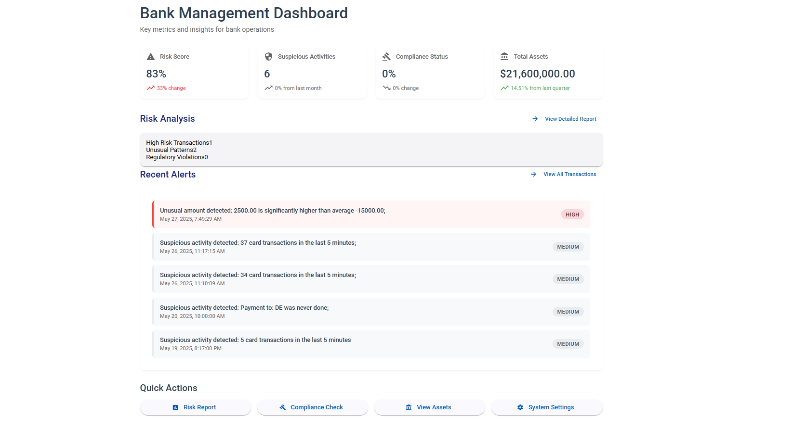
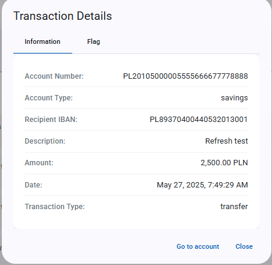
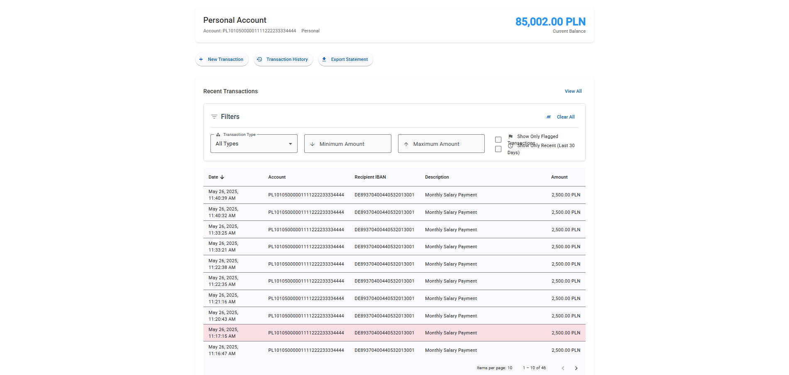
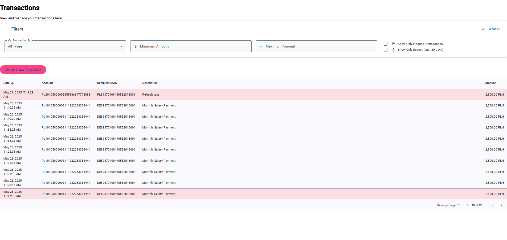

# 🏦 Bank Management System with Fraud Detection

This project is a **Bank Management System** enhanced with a mechanism for detecting potential **financial fraud**. It provides a web-based dashboard for viewing and managing banking transactions and alerts related to suspicious activities.

## Tech used 🛠️

  

## 📌 Key Features

- **Real-time fraud flagging**:
  - Detects rapid card transactions in a short time frame
  - Flags money transfers to new countries
  - Identifies unusually large transaction amounts
- **Dashboard interface**:
  - Displays recent flagged transactions
  - Visual representation of transaction history
  - User account views
- **MongoDB integration**:
  - Stores and displays bank assets and total values

## Screenshots 🖼️

<table align="center">
  <tr>
    <td>
      
      
Dashboard

    </td>
    <td>
      
      
Transaction Details

    </td>
  </tr>
  <tr>
    <td>
      
      
User

    </td>
    <td>
      
      
Transactions Filter

    </td>
  </tr>
</table>

## Created with 💚 by
[Artur Niemiec](https://anindustries.pl/) - ([@MrNtex](https://www.github.com/MrNtex))
